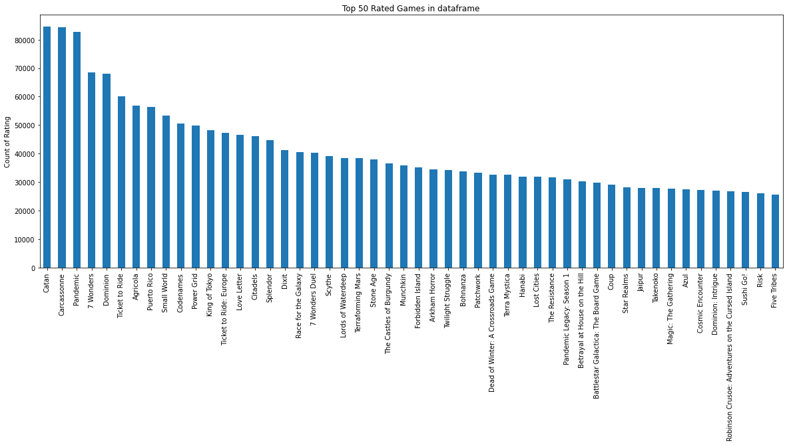
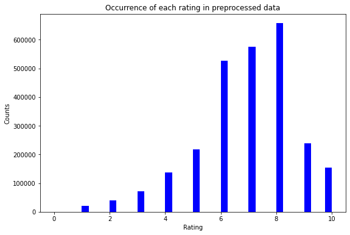
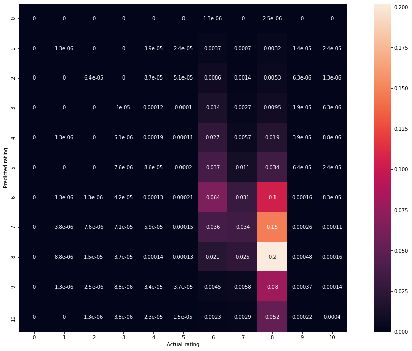
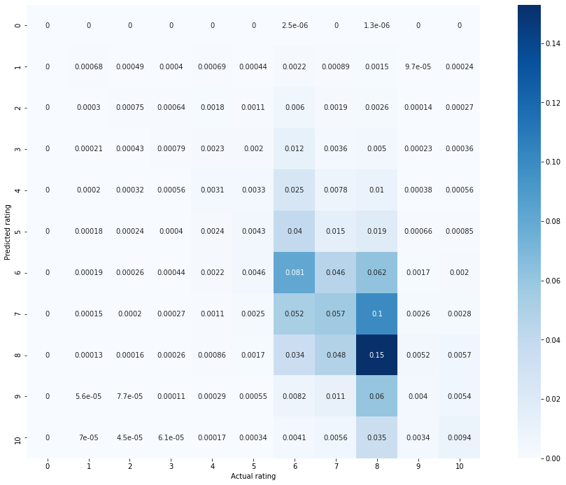
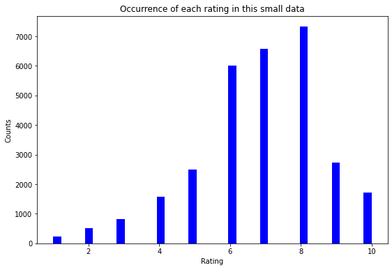
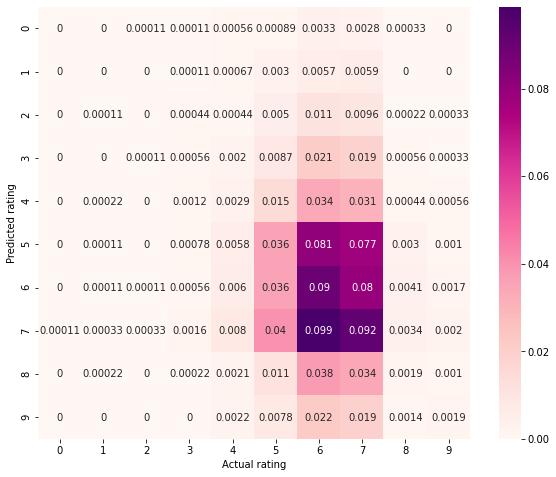
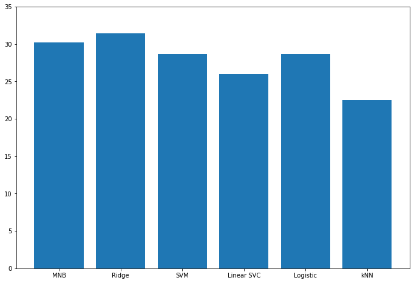

<center><b><h1>Data Mining Term Project Spring 2020</h1></bold></center>
<center><bold><h2>Game rating prediction</h2></bold></center>

>Name: Patel, Meetkumar Jigneshbhai<br>
>UTA ID: 100175000

Aim of this project:<br>
---

The goal of the term project is building a classifier that you can show to someone with your homepage that will help you look competent. Make improvements over the reference you are using to clssiy the object. Explain challenges you faced and your conttributions. Additionally, build a web application to present a demo of working of model for given user input (review).<br><br>

Important Links:
---
1.   GitHub: https://github.com/Meet1809/datamining_final_project
2.   Youtube video:<br>
        1. https://youtu.be/w9lR2Sb1LEs (Web app) <br>
        2. https://youtu.be/NKvUX3fOn9Q (This video contains classification in jupyter notebook only) 
3. Web App: https://peaceful-castle-76181.herokuapp.com/ (Click this link to go to web app)
3. My website: http://patelmeetkumar.uta.cloud/profile/
4. Blog: http://patelmeetkumar.uta.cloud/blog/

<br>

Step by step instructions:
---
1. If you are running the jupyter notebook on your system then you should have installed all the libraries (dependencies) that I am using in the project by pip or conda on your system environment.
2. Now, about flask web application:<br>
    A. If you are running flask application file on local machine then use following command.
      >python app.py<br>

      This will start local server on URL: http://127.0.0.1:5000/ 

    B. If you want to run it and test it on server (Heroku). Then you should have installed all dependencied that I have mentioned in requirements.txt file.<br>
    After that, deploy from Heroku server.


<br><h2>Overview of this notebook:</h2>

1.   I have used Board game geek dataset from kaggle:<br>
     Link: https://www.kaggle.com/jvanelteren/boardgamegeek-reviews<br>

2.   This dataset has 13million rows which is quite large dataset for the system that we use, so I have implemented this project on google colaboratory.<br>

3.    Data preprocessing on dataset:<br>
    Dara preprocessing is most crucial task in text analysis as well as in deep learning tasks. If you do not perform any pre processing on your raw data, then it will affect your model's performance and to your final result. Generally, in this step we remove emojis, stop words, some rare occurring words from text. Also lower capitalization and tokenization are performed. In preprocessing, I removed all the rows having no values in comment column, as without comment value there is nothing to predict. To remove stop words from comments, first, I tokenized those comments using tokenizer tool provided by Natural Language toolkit (NLTK), and then removed those stop words. In nltk, there is one class "corpus" which contains list of these stop words. Along with them, comments are also converted into lower alphabets using lower() function.<br>
4. Data visualization:
    For data visualization, matplotlib, seaborn libraries are used. Data is postulated by heatmap, bar graph with appropriate labels on axis and legends.

4.   Models for data training and testing:<br>
    There are so many models for text classification, Naive Bayes, Support vector machine, random forest, ridge regression, linear regression, etc.<br>
    I have used some of those models in order to get the best accuracy on the dataset I am using.<br>

5.   Performance evaluation of algorithms:<br>
    We must know how our algorithm is working. For that purpose, some accuracy measures, error measurement techniques are used. <br>
    Such as, confusion matrix, F1 score, precision, recall, etc.

<br>

<h2>Classifiers in this project:</h2>


>1. Multinomial Naive Bayes

This is basic logic behind naive bayes. It is all about conditional dependency.The term Multinomial Naive Bayes simply lets us know that each p(fi|c) is a multinomial distribution, rather than some other distribution. This works well for data which can easily be turned into counts, such as word counts in text.<br> 
<br><br>


>2. Ridge Classifier

This classifier first converts the target values into {-1, 1} and then treats the problem as a regression task (multi-output regression in the multiclass case). The L2 norm term in ridge regression is weighted by the regularization parameter alpha. So, if the alpha value is 0, it means that it is just an Ordinary Least Squares Regression model. So, the larger is the alpha, the higher is the smoothness constraint.

<br>


>3. Support vector machine<br>

SVM is a supervised machine learning algorithm which can be used for classification or regression problems.Support vectors are data points that are closer to the hyperplane and influence the position and orientation of the hyperplane. Using these support vectors, we maximize the margin of the classifier. SVM has one argument named "kernel", which specifies, the hyperplane shape which separates labels. I am using Linear shape for kernel value.<br>


>4. k nearest neighbours<br>

kNN is easy-to-implement supervised machine learning algorithm that can be used to solve both classification and regression problems. The KNN algorithm assumes that similar things exist in close proximity. In other words, similar things are near to each other. To select the K that’s right for your data, we run the KNN algorithm several times with different values of K and choose the K that reduces the number of errors we encounter while maintaining the algorithm’s ability to accurately make predictions when it’s given data it hasn’t seen before.
<br>


>5. Logistic regression

Logistic regression is the appropriate regression analysis to conduct when the dependent variable is dichotomous (binary). Logistic regression is a statistical model that in its basic form uses a logistic function. Logistic regression is used to describe data and to explain the relationship between one dependent binary variable and one or more nominal, ordinal, interval or ratio-level independent variables.<br><br>
Below image shows difference between linear and logistic regression.
<br>


>Ensemble methods<br>

Ensemple method is machine learning trechnique which improves accuracy of algorithm by combining two or more individual algorithms for same dataset. There are many techniques by which we can perform ensembling of multiple classifier. Like, Bagging, boosting, usinf random forests, etc. But here I am using weighted voting over three classifiers.<br>
<br><br>
Below is the **architecture** of working of ensemble methods.<br>


<br>
Evaluation Score
---
>After testing the classifiers on different samples of dataset, I received following evaluation score (accuracy).

For Multinomial Naive Bayes and Ridge classifier I used whole dataset after cleaning. Length = 2637756 <br>
1. Multinomial Naive Bayes: 30.164 %
2. Ridge classifier: 31.380 %

For support vector machine, logistic regression, linear SVC model and k nearest neighbors only 30000-50000 data sample. Because I want to perform ensemble method on these models, because by taking more data, session was crashing.
1. Support vector machine: 28.678 %
2. Linear SVC: 26.0 % 
3. Logistic regression: 28.633 %
4. k Nearest neighbors: 22.533 %

I performed Ensemble method with weighted voting classifier on SVC, kNN and logistic regression model with 2,1 and 3 weights respectively.
1. Accuracy of ensemble method: 28.811 %

<br>

Difference over References:
---
1. The guy in this reference is using Countvectorizer for vectorization of words. CountVectorizer just counts the word frequencies. I used TFIDFVectorizer for the same purpose, but with the TFIDFVectorizer the value increases proportionally to count, but is offset by the frequency of the word in the corpus. It helps us to deal with most frequent words in document. IDF states for inverse document frequency.<br>
https://www.kaggle.com/ngrq94/boardgamegeek-reviews-data-preparation 

<br>

Challenged Faced
---

The dataset was too large for the systems we are using, so I need to pre process data first in order to use it for training and testing. For pre processing I had to use case lowering, tokenization, regular expression for alphabets, punctuation removal and removing stop words.<br>

Dataset contains so many (above 70%) missing values (NaN) in comment column, which is required to predict rating. Before proceeding further removed these rows without affecting accuracy and meaningful data.<br>

I used Flask to write web application code for text classification. Flask is quite hard to understand, but what is more peculier than code is it's deployment on live server. Heroku is tool that I am using for deployment. There are so many required dependencies to make flask program compatible. It took me straight 3 hours for deployment.<br>

By using pipeline I could have got accuracy in less time, but it would not give precise information about hyperparameters, so I choose the other way. But achieved this results after so many crash of kernel.

<br>
Importing required dependencies and mounting google drive for data fetching
---


```python
import os
import sys
import re
import numpy as np
import seaborn as sb
import pandas as pd
import matplotlib.pyplot as plt
from matplotlib.ticker import FuncFormatter
from sklearn.model_selection import train_test_split
from sklearn import feature_extraction, linear_model, model_selection,preprocessing
from sklearn.pipeline import Pipeline
from sklearn.feature_extraction.text import TfidfVectorizer, CountVectorizer, TfidfTransformer
from sklearn.naive_bayes import MultinomialNB
from sklearn.metrics import confusion_matrix,f1_score,recall_score,precision_score,classification_report
from sklearn.feature_selection import chi2
from sklearn.linear_model import LogisticRegression,Ridge,RidgeClassifier
from sklearn.neighbors import KNeighborsClassifier
from sklearn.svm import SVC,LinearSVC
from sklearn.metrics import accuracy_score
import time
from time import sleep
#nltk toolkit used for stopwords removing
import nltk
from nltk.corpus import stopwords
from nltk import word_tokenize
nltk.download('punkt')
nltk.download("stopwords")
```

    /usr/local/lib/python3.6/dist-packages/statsmodels/tools/_testing.py:19: FutureWarning: pandas.util.testing is deprecated. Use the functions in the public API at pandas.testing instead.
      import pandas.util.testing as tm
    

    [nltk_data] Downloading package punkt to /root/nltk_data...
    [nltk_data]   Unzipping tokenizers/punkt.zip.
    [nltk_data] Downloading package stopwords to /root/nltk_data...
    [nltk_data]   Unzipping corpora/stopwords.zip.
    


    True


Mounting google drive to read dataset


```python
#code to mount google drive for data 
from google.colab import drive
drive.mount('/content/gdrive')
```

    Go to this URL in a browser: https://accounts.google.com/o/oauth2/auth?client_id=947318989803-6bn6qk8qdgf4n4g3pfee6491hc0brc4i.apps.googleusercontent.com&redirect_uri=urn%3aietf%3awg%3aoauth%3a2.0%3aoob&response_type=code&scope=email%20https%3a%2f%2fwww.googleapis.com%2fauth%2fdocs.test%20https%3a%2f%2fwww.googleapis.com%2fauth%2fdrive%20https%3a%2f%2fwww.googleapis.com%2fauth%2fdrive.photos.readonly%20https%3a%2f%2fwww.googleapis.com%2fauth%2fpeopleapi.readonly
    
    Enter your authorization code:
    ··········
    Mounted at /content/gdrive
    


```python
os.chdir('/content/gdrive/My Drive/Data mining/')
```
<br>
Data acquisition of Board Game Geek dataset from google drive
---


```python
#data acquisition from the given path in google drive
review_data_game = pd.read_csv("bgg-13m-reviews.csv")
print("Length of review data: ",len(review_data_game))
#representing first five rows from dataframe
review_data_game.head()
```

    Length of review data:  13170073
    


<div>
<style scoped>
    .dataframe tbody tr th:only-of-type {
        vertical-align: middle;
    }

    .dataframe tbody tr th {
        vertical-align: top;
    }

    .dataframe thead th {
        text-align: right;
    }
</style>
<table border="1" class="dataframe">
  <thead>
    <tr style="text-align: right;">
      <th></th>
      <th>Unnamed: 0</th>
      <th>user</th>
      <th>rating</th>
      <th>comment</th>
      <th>ID</th>
      <th>name</th>
    </tr>
  </thead>
  <tbody>
    <tr>
      <th>0</th>
      <td>0</td>
      <td>sidehacker</td>
      <td>10.0</td>
      <td>NaN</td>
      <td>13</td>
      <td>Catan</td>
    </tr>
    <tr>
      <th>1</th>
      <td>1</td>
      <td>Varthlokkur</td>
      <td>10.0</td>
      <td>NaN</td>
      <td>13</td>
      <td>Catan</td>
    </tr>
    <tr>
      <th>2</th>
      <td>2</td>
      <td>dougthonus</td>
      <td>10.0</td>
      <td>Currently, this sits on my list as my favorite...</td>
      <td>13</td>
      <td>Catan</td>
    </tr>
    <tr>
      <th>3</th>
      <td>3</td>
      <td>cypar7</td>
      <td>10.0</td>
      <td>I know it says how many plays, but many, many ...</td>
      <td>13</td>
      <td>Catan</td>
    </tr>
    <tr>
      <th>4</th>
      <td>4</td>
      <td>ssmooth</td>
      <td>10.0</td>
      <td>NaN</td>
      <td>13</td>
      <td>Catan</td>
    </tr>
  </tbody>
</table>
</div>
<br>


Pre-processing of the dataset
---


```python
# counting total NaN values in each column
review_data_game.isna().sum()
```


    Unnamed: 0           0
    user                66
    rating               0
    comment       10532317
    ID                   0
    name                 0
    dtype: int64


```python
# this chart represents top 50 rated words from dataframe 
plt.figure(figsize=(18, 7))
review_data_game['name'].value_counts()[:50].plot(kind='bar')
plt.ylabel('Count of Rating')
plt.title('Top 50 Rated Games in dataframe')
plt.show()
```





```python
review_data_game = review_data_game[['comment','rating']]
#removing missing values from dataframe
review_data_game.dropna(inplace=True)
print("Length of dataset after removing missing values: ",len(review_data_game))
print('')
review_data_game.head()
```

    Length of dataset after removing missing values:  2637756
    
    


<div>
<style scoped>
    .dataframe tbody tr th:only-of-type {
        vertical-align: middle;
    }

    .dataframe tbody tr th {
        vertical-align: top;
    }

    .dataframe thead th {
        text-align: right;
    }
</style>
<table border="1" class="dataframe">
  <thead>
    <tr style="text-align: right;">
      <th></th>
      <th>comment</th>
      <th>rating</th>
    </tr>
  </thead>
  <tbody>
    <tr>
      <th>2</th>
      <td>Currently, this sits on my list as my favorite...</td>
      <td>10.0</td>
    </tr>
    <tr>
      <th>3</th>
      <td>I know it says how many plays, but many, many ...</td>
      <td>10.0</td>
    </tr>
    <tr>
      <th>7</th>
      <td>i will never tire of this game.. Awesome</td>
      <td>10.0</td>
    </tr>
    <tr>
      <th>11</th>
      <td>This is probably the best game I ever played. ...</td>
      <td>10.0</td>
    </tr>
    <tr>
      <th>16</th>
      <td>Fantastic game. Got me hooked on games all ove...</td>
      <td>10.0</td>
    </tr>
  </tbody>
</table>
</div>


```python
#tokenization of comments column and removing punctuation
from nltk.tokenize import RegexpTokenizer
#this regular expression tokenize words in comma separated form
tokenizer = RegexpTokenizer(r'\w+')
review_data_game['comment'] = review_data_game['comment'].apply(lambda x: tokenizer.tokenize(x.lower()))
review_data_game.head()
```


<div>
<style scoped>
    .dataframe tbody tr th:only-of-type {
        vertical-align: middle;
    }

    .dataframe tbody tr th {
        vertical-align: top;
    }

    .dataframe thead th {
        text-align: right;
    }
</style>
<table border="1" class="dataframe">
  <thead>
    <tr style="text-align: right;">
      <th></th>
      <th>comment</th>
      <th>rating</th>
    </tr>
  </thead>
  <tbody>
    <tr>
      <th>2</th>
      <td>[currently, this, sits, on, my, list, as, my, ...</td>
      <td>10.0</td>
    </tr>
    <tr>
      <th>3</th>
      <td>[i, know, it, says, how, many, plays, but, man...</td>
      <td>10.0</td>
    </tr>
    <tr>
      <th>7</th>
      <td>[i, will, never, tire, of, this, game, awesome]</td>
      <td>10.0</td>
    </tr>
    <tr>
      <th>11</th>
      <td>[this, is, probably, the, best, game, i, ever,...</td>
      <td>10.0</td>
    </tr>
    <tr>
      <th>16</th>
      <td>[fantastic, game, got, me, hooked, on, games, ...</td>
      <td>10.0</td>
    </tr>
  </tbody>
</table>
</div>


```python
#removing stop words from comments 
stops = set(stopwords.words("english"))
review_data_game['comment'] = review_data_game['comment'].apply(lambda x: [item for item in x if item not in stops])
review_data_game.head(10)
```


<div>
<style scoped>
    .dataframe tbody tr th:only-of-type {
        vertical-align: middle;
    }

    .dataframe tbody tr th {
        vertical-align: top;
    }

    .dataframe thead th {
        text-align: right;
    }
</style>
<table border="1" class="dataframe">
  <thead>
    <tr style="text-align: right;">
      <th></th>
      <th>comment</th>
      <th>rating</th>
    </tr>
  </thead>
  <tbody>
    <tr>
      <th>2</th>
      <td>[currently, sits, list, favorite, game]</td>
      <td>10.0</td>
    </tr>
    <tr>
      <th>3</th>
      <td>[know, says, many, plays, many, many, uncounte...</td>
      <td>10.0</td>
    </tr>
    <tr>
      <th>7</th>
      <td>[never, tire, game, awesome]</td>
      <td>10.0</td>
    </tr>
    <tr>
      <th>11</th>
      <td>[probably, best, game, ever, played, requires,...</td>
      <td>10.0</td>
    </tr>
    <tr>
      <th>16</th>
      <td>[fantastic, game, got, hooked, games]</td>
      <td>10.0</td>
    </tr>
    <tr>
      <th>17</th>
      <td>[one, best, games, ever, created, period, new,...</td>
      <td>10.0</td>
    </tr>
    <tr>
      <th>19</th>
      <td>[game, 9, strategy, game, family, asks, play, ...</td>
      <td>10.0</td>
    </tr>
    <tr>
      <th>20</th>
      <td>[great, game, even, got, number, non, game, pl...</td>
      <td>10.0</td>
    </tr>
    <tr>
      <th>21</th>
      <td>[one, time, favorite, games, usually, get, pla...</td>
      <td>10.0</td>
    </tr>
    <tr>
      <th>25</th>
      <td>[settlers, gem, havn, played, suggest, go, get...</td>
      <td>10.0</td>
    </tr>
  </tbody>
</table>
</div>


```python
#joining all tokens to proceed further for data modeling
review_data_game['comment'] = review_data_game['comment'].apply(' '.join)
```


```python
review_data_game.head()
```


<div>
<style scoped>
    .dataframe tbody tr th:only-of-type {
        vertical-align: middle;
    }

    .dataframe tbody tr th {
        vertical-align: top;
    }

    .dataframe thead th {
        text-align: right;
    }
</style>
<table border="1" class="dataframe">
  <thead>
    <tr style="text-align: right;">
      <th></th>
      <th>comment</th>
      <th>rating</th>
    </tr>
  </thead>
  <tbody>
    <tr>
      <th>2</th>
      <td>currently sits list favorite game</td>
      <td>10.0</td>
    </tr>
    <tr>
      <th>3</th>
      <td>know says many plays many many uncounted liked...</td>
      <td>10.0</td>
    </tr>
    <tr>
      <th>7</th>
      <td>never tire game awesome</td>
      <td>10.0</td>
    </tr>
    <tr>
      <th>11</th>
      <td>probably best game ever played requires thinki...</td>
      <td>10.0</td>
    </tr>
    <tr>
      <th>16</th>
      <td>fantastic game got hooked games</td>
      <td>10.0</td>
    </tr>
  </tbody>
</table>
</div>


>Data visualization


```python
#histogram representing how much time each ratings occur
fig = plt.figure(figsize=(9,6))
n, bins, patches = plt.hist(review_data_game.rating, bins=40, facecolor='blue',alpha = 1)
plt.xlabel('Rating')
plt.ylabel('Counts')
plt.title('Occurrence of each rating in preprocessed data')
fig.patch.set_facecolor('white')
plt.show()
# width of bars are defined using value of bin
```





* As we can see, most of the ratings are between 6 and 8.
* Below functions explains exact values.


```python
#average value of all the ratings 
print("Average rating: ",review_data_game['rating'].mean())
#median value of ratings values
print("Median value: ",review_data_game['rating'].median())
```

    Average rating:  6.852069823043514
    Median value:  7.0
    
<br>

Model Creation and testing 
---


```python
#selecting chunk of data (if you want) from whole dataframe for further model training and testing
review_data = review_data_game
```


```python
#rounding up all values of rating column such that: 7.8 ~ 8.0
review_data['rating'] =np.round(review_data['rating'])
```


```python
#occurance of each rating in the column
review_data['rating'].value_counts()
```


    8.0     657581
    7.0     574586
    6.0     526481
    9.0     239410
    5.0     217766
    10.0    153530
    4.0     136565
    3.0      70974
    2.0      40766
    1.0      20086
    0.0         11
    Name: rating, dtype: int64


```python
#splitting dataset in to four parts randomly
X_train, X_test, y_train, y_test = train_test_split(review_data['comment'], review_data['rating'], test_size=0.3) # 70% training and 30% test
```

>TF-IDF stands for term frequency-inverse document frequency.TF-IDF is a weight often used in information retrieval and text mining.Tf-idf can be successfully used for stop-words filtering and text lowering in various subject fields including text summarization and classification.<br>

TfidfVectorizer:<br>
Transforms text into a sparse matrix of n-gram counts.<br>
TfidfVectorizer and CountVectorizer both are same thing.<br>
TfidfTransformer:<br>
Performs the TF-IDF transformation from a provided matrix of counts.<br>

Even if you use only vectorizer and then do model fitting, it works. I am just using for better accuracy and effectiveness of vectors on model.


```python
#vectorizing our data
#Convert a collection of raw documents to a matrix of TF-IDF features
vectorizer = TfidfVectorizer()
transformer = TfidfTransformer()

X_train = vectorizer.fit_transform(X_train)
X_test = vectorizer.transform(X_test)

X_train_counts = transformer.fit_transform(X_train)
X_test_counts = transformer.fit_transform(X_test)
```


> Multinomial NaiveBayes


```python
model_mNB = MultinomialNB().fit(X_train_counts, y_train.astype('int'))
y_predicted_mNB = model_mNB.predict(X_test_counts)

accuracy = accuracy_score(y_test.astype('int'),y_predicted_mNB) * float(100)
accuracy_mNB = str(accuracy)
print('Testing Accuracy on multinomial naive bayes model is: '+accuracy_mNB+' %')
```

    Testing Accuracy on multinomial naive bayes model is: 30.163762894479778 %
    


```python
#confusion matrix for what output we got
print("Confusion matrix for Multinomial Naive Bayes classifier:\n")
fig= plt.figure(figsize=(15,9))
ax = fig.add_axes([1,1,1,1])
matrix = confusion_matrix(y_test.astype('int'), y_predicted_mNB)
sb.heatmap(matrix/np.sum(matrix), square=True, annot=True)
ax.set_xlabel('Actual rating')
ax.set_ylabel('Predicted rating')
```

    Confusion matrix for Multinomial Naive Bayes classifier:
    
    


    Text(1274.9999999999998, 0.5, 'Predicted rating')





>Heatmap explanation:<br>
    
In above, heatmap accuracy is shown that how many times actual label is predicted correctly. As value gets bigger, it gets lighter( in this case ). i.e. We can see that value "8" is predicted correctly 20% of the time. Also "8" is predicted as "7", 15% times.<br>
I have implemented further maps in different color to better visualize it.

>Ridge Classifier<br>


```python
model_ridge_class = RidgeClassifier().fit(X_train_counts, y_train.astype('int'))
y_predicted = model_ridge_class.predict(X_test_counts)
y_predicted_ridge_class = np.round(y_predicted)
accuracy = accuracy_score(y_test,y_predicted_ridge_class) * float(100)
ridge_class_accuracy = str(accuracy)
print('Testing Accuracy on ridge classifier model is: '+ridge_class_accuracy+' %')
```

    Testing Accuracy on ridge classifier model is: 31.38057970977864 %
    


```python
print("Confusion matrix for Ridge Classifier:\n")
fig= plt.figure(figsize=(15,9))
ax = fig.add_axes([1,1,1,1])
matrix = confusion_matrix(y_test.astype('int'), y_predicted_ridge_class)
sb.heatmap(matrix/np.sum(matrix), square=True, annot=True, cmap="Blues")
ax.set_xlabel('Actual rating')
ax.set_ylabel('Predicted rating')
```

    Confusion matrix for Ridge Classifier:
    
    


    Text(1274.9999999999998, 0.5, 'Predicted rating')





```python
#well this is fun part. 
#input your string at smt value and get rating for that.
#here you can test rating for your desired review
smt = "worst game dont play always play"
smt=[smt]
smt = vectorizer.transform(smt)
smt = transformer.fit_transform(smt)
prediction = np.round(model_ridge_class.predict(smt))
print(prediction)
```

    [1]
    

>Classification report for the above two classifiers<br>

This report contains values like, precision, recall, support and f1 score.These values help us to determine what is the error for testing data.


```python
#computing f1 score to find weighted average of precision and recall
#f1 score is always defined in range of [0,1]
#where 0 is worse case and 1 is considered as best case
#recall is ratio of True positive over sum of true positive and false negative
#precision is ratio of True positive over sum of true positive and false positive
#support is total number of instances in the set 
labels = ['0.0','1.0','2.0','3.0','4.0','5.0','6.0','7.0','8.0','9.0','10.0']
p = classification_report(y_test.astype('int'), y_predicted_mNB, target_names=labels,zero_division=1)
print("Representation of classification matrix on a per-class basis:\n")
print("Report for multinomial naive bayes:\n ")
print(p)
print('')
p = classification_report(y_test.astype('int'), y_predicted_ridge_class, target_names=labels,zero_division=1,)
print("Report for Ridge regression:\n ")
print(p)
```

    Representation of classification matrix on a per-class basis:
    
    Report for multinomial naive bayes:
     
                  precision    recall  f1-score   support
    
             0.0       1.00      0.00      0.00         3
             1.0       0.07      0.00      0.00      6034
             2.0       0.70      0.00      0.01     12262
             3.0       0.05      0.00      0.00     21241
             4.0       0.21      0.00      0.01     40883
             5.0       0.19      0.00      0.00     65259
             6.0       0.29      0.32      0.31    158432
             7.0       0.28      0.16      0.20    172641
             8.0       0.31      0.81      0.45    197190
             9.0       0.23      0.00      0.01     71629
            10.0       0.42      0.01      0.01     45753
    
        accuracy                           0.30    791327
       macro avg       0.34      0.12      0.09    791327
    weighted avg       0.28      0.30      0.22    791327
    
    
    Report for Ridge regression:
     
                  precision    recall  f1-score   support
    
             0.0       1.00      0.00      0.00         3
             1.0       0.31      0.09      0.14      6034
             2.0       0.25      0.05      0.08     12262
             3.0       0.20      0.03      0.05     21241
             4.0       0.21      0.06      0.09     40883
             5.0       0.21      0.05      0.08     65259
             6.0       0.31      0.40      0.35    158432
             7.0       0.29      0.26      0.27    172641
             8.0       0.34      0.61      0.44    197190
             9.0       0.22      0.04      0.07     71629
            10.0       0.34      0.16      0.22     45753
    
        accuracy                           0.31    791327
       macro avg       0.33      0.16      0.16    791327
    weighted avg       0.29      0.31      0.27    791327
    
    
<br>

Some other models
---

I have trained these models for some small number of dataset values (20000-30000). Just to check their performance, accuracy, and time consumption. Because I am using these classifiers to implement ensemble methods. So it is better to use lesser data.


```python
small_review_data = review_data_game.sample(n=30000)
small_review_data['rating'] =np.round(small_review_data['rating'])
X_train_small, X_test_small, y_train_small, y_test_small = train_test_split(small_review_data['comment'], small_review_data['rating'], test_size=0.3) # 70% training and 30% test
```


```python
#histogram representing how much time each ratings occur
fig = plt.figure(figsize=(9,6))
n, bins, patches = plt.hist(small_review_data.rating, bins=40, facecolor='blue',alpha = 1)
plt.xlabel('Rating')
plt.ylabel('Counts')
plt.title('Occurrence of each rating in this small data')
fig.patch.set_facecolor('white')
plt.show()
# width of bars are defined using value of bin
```





```python
#vectorizing our data
vect = TfidfVectorizer()
trans = TfidfTransformer()

X_train_small = vect.fit_transform(X_train_small)
X_test_small = vect.transform(X_test_small)

X_train_small = trans.fit_transform(X_train_small)
X_test_small = trans.fit_transform(X_test_small)
#model_SVM = Pipeline([
#    ('Tfidf_vectorizer', TfidfVectorizer()), 
#    ('Tfidf_transformer',  TfidfTransformer()), 
#    ('classifier', SVC(kernel="linear"))])  #this kernel=linear argument states that decision boundary to separate data is straight line
```


> Support vector machine (SVC)


```python
model_SVC = SVC(kernel="linear",probability=True).fit(X_train_small,y_train_small.astype('int'))
#this kernel=linear argument states that decision boundary to separate data is straight line
y_predicted_SVC = model_SVC.predict(X_test_small)
accuracy = accuracy_score(y_test_small.astype('int'),y_predicted_SVC) * float(100)
accuracy_svc = str(accuracy)
print('Testing Accuracy is: '+accuracy_svc+' %')
```

    Testing Accuracy is: 28.67777777777778 %
    


```python
print("Confusion matrix for Support vector machine:\n")
fig= plt.figure(figsize=(8,6))
ax = fig.add_axes([1,1,1,1])
matrix = confusion_matrix(y_test_small.astype('int'), y_predicted_SVC)
sb.heatmap(matrix/np.sum(matrix), square=True, annot=True, cmap="Greys")
ax.set_xlabel('Actual rating')
ax.set_ylabel('Predicted rating')
```

    Confusion matrix for Support vector machine:
    
    


    Text(583.8, 0.5, 'Predicted rating')


> Support vector machine (Linear SVC)
* We will use same number of samples in SVC and Linear SVC for accuracy comparison


```python
model_linear_SVC = LinearSVC().fit(X_train_small,y_train_small.astype('int'))
y_predicted_linear_SVC = model_linear_SVC.predict(X_test_small)
accuracy = accuracy_score(y_test_small.astype('int'),y_predicted_linear_SVC) * float(100)
accuracy_linear_svc = str(accuracy)
print('Testing Accuracy is: '+accuracy_linear_svc+' %')
```

    Testing Accuracy is: 26.0 %
    


```python
print("Confusion matrix for Linear Support vector machine:\n")
fig= plt.figure(figsize=(8,6))
ax = fig.add_axes([1,1,1,1])
matrix = confusion_matrix(y_test_small.astype('int'), y_predicted_linear_SVC)
sb.heatmap(matrix/np.sum(matrix), square=True, annot=True, cmap="Reds")
ax.set_xlabel('Actual rating')
ax.set_ylabel('Predicted rating')
```

    Confusion matrix for Linear Support vector machine:
    
    


    Text(583.8, 0.5, 'Predicted rating')


* For same number of training and testing data, SVC model gives better accuracy than Linear SVC model, but at cost of time.


> Logistic Regression


```python
model_Logistic_Regression = LogisticRegression(max_iter=20000).fit(X_train_small,y_train_small.astype('int'))
y_predicted_log_reg = model_Logistic_Regression.predict(X_test_small)
accuracy = accuracy_score(y_test_small.astype('int'),y_predicted_log_reg) * float(100)
accuracy_log_reg = str(accuracy)
print('Testing Accuracy is: '+accuracy_log_reg+' %')
```

    Testing Accuracy is: 28.633333333333333 %
    

* Logistic regression gives almost same accuracy as SVC model in even lesser time


```python
print("Confusion matrix for Logistic regression:\n")
fig= plt.figure(figsize=(8,6))
ax = fig.add_axes([1,1,1,1])
matrix = confusion_matrix(y_test_small.astype('int'), y_predicted_log_reg)
sb.heatmap(matrix/np.sum(matrix), square=True, annot=True, cmap="BuPu")
ax.set_xlabel('Actual rating')
ax.set_ylabel('Predicted rating')
```

    Confusion matrix for Logistic regression:
    
    


    Text(583.8, 0.5, 'Predicted rating')


>K nearest neighbours


```python
model_kNN = KNeighborsClassifier(n_neighbors=10).fit(X_train_small,y_train_small.astype('int'))
y_predicted_knn = model_kNN.predict(X_test_small)
accuracy = accuracy_score(y_test_small.astype('int'),y_predicted_knn) * float(100)
accuracy_knn = str(accuracy)
print('Testing Accuracy is: '+accuracy_knn+' %')
```

    Testing Accuracy is: 22.53333333333333 %
    


```python
print("Confusion matrix for kNN:\n")
matrix = confusion_matrix(y_test_small.astype('int'), y_predicted_knn)
fig= plt.figure(figsize=(8,6))
ax = fig.add_axes([1,1,1,1])
sb.heatmap(matrix/np.sum(matrix), square=True, annot=True, cmap="RdPu")
ax.set_xlabel('Actual rating')
ax.set_ylabel('Predicted rating')
```

    Confusion matrix for kNN:
    
    


    Text(583.8, 0.5, 'Predicted rating')




<br>

Ensemble methods
---

Ensemple method is machine learning trechnique which improves accuracy of algorithm by combining two or more individual algorithms for same dataset.<br>
On above part, I got accuracy for SVC, Linear SVC, logistic regression, but that is very low to classify some random text.<br>
SO here, I am using ensemble method on those algorithms to get better accuracy than what I have got.<br>


```python
from sklearn.ensemble import VotingClassifier
Ensemble = VotingClassifier(estimators=[('Linear SVC',model_SVC),('knn',model_kNN),('logistic',model_Logistic_Regression)],voting='soft',weights=[2,1,3])
model_ensemble = Ensemble.fit(X_train_small,y_train_small.astype('int'))
ensemble_predicted = model_ensemble.predict(X_test_small)
accuracy_ensemble = accuracy_score(ensemble_predicted,y_test_small.astype('int'))* float(100)
accuracy_ensemble = str(accuracy_ensemble)
print('Testing Accuracy is: '+accuracy_ensemble+' %')
```

    Testing Accuracy is: 28.81111111111111 %
    

* As we can see, after ensembling Logistic regression, kNN and SVC algorithms we got better accuracy than what they have individually achieved.  


```python
print("Confusion matrix for Ensemble methos for given estimators:\n")
matrix = confusion_matrix(y_test_small.astype('int'), ensemble_predicted)
fig= plt.figure(figsize=(8,6))
ax = fig.add_axes([1,1,1,1])
sb.heatmap(matrix/np.sum(matrix), square=True, annot=True, cmap="Purples")
ax.set_xlabel('Actual rating')
ax.set_ylabel('Predicted rating')
```

    Confusion matrix for Ensemble methos for given estimators:
    
    


    Text(583.8, 0.5, 'Predicted rating')


Final Test
---

Here i have visualized accuracy of all the classifiers to compare. From graph we can go for final classifer for our testing.


```python
acc1 = float(accuracy_mNB)
acc2 = float(ridge_class_accuracy)
acc3 = float(accuracy_svc)
acc4 = float(accuracy_linear_svc)
acc5 = float(accuracy_log_reg)
acc6 = float(accuracy_knn)
```


```python
acc=[]
acc.append(acc1)
acc.append(acc2)
acc.append(acc3)
acc.append(acc4)
acc.append(acc5)
acc.append(acc6)
```


```python
fig = plt.figure(figsize=(9,6))
labels = ['MNB','Ridge','SVM','Linear SVC','Logistic','kNN']
#acc = [30.163762894479778,31.38057970977864, 28.67777777777778, 26.0, 28.633333333333333, 22.53333333333333]
ax = fig.add_axes([0, 0, 1, 1])
ax.bar(labels,acc)
plt.ylim(0,35)
plt.show()
```





>From above all classifiers and ensemble methods, Ridge classifier gives best output (prediction) for given review. So we are using that one for random review inputs.


```python
def redge_acc(smt):
  smt=[smt] #converting text into array for code compatibility
  smt = vectorizer.transform(smt) #vectorize data
  smt = transformer.fit_transform(smt) #transforming input string vector
  prediction = np.round(model_ridge_class.predict(smt)) #using ridge classifier trained model to predict rating for what user has gave input
  return prediction
```


```python
while True:
  smt = input("Insert your review: \n")
  rating_prediction = redge_acc(smt)
  print("\nRating: ",int(rating_prediction))
  print("\n")
```
<br>

Contributions
---


1.   The reference that  i have used for support vector machine, it was done without using any hyperparameters. I have implemented it's probability and "linear" kernel and got improved accuracy. 
2.   Implemented Ensemble methods over some of selected classifiers. I achieved a good accuracy than those individuals are getting. I used voting classifier in ensemble methods, with appropriate weighted voting to three classifiers. As I have used less data for those classifiers, accuracy is less. But for larger data surely would get better results. 
3. Saved model in local system for further any classification purpose. 


<br>

Challenges faced:
---


1.   The dataset was too large for the systems we are using, so I need to pre process data first in order to use it for training and testing. For pre processing I have to use case lowering, tokenization, regular expression for alphabets, punctuation removal and removing stop words.
2. Dataset contains so many (above 70%) missing values (NaN) in comment column, which is required to predict rating. Before proceeding further removed these rows without affecting accuracy and meaningful data.
3. I used Flask to write web application code for text classification. Flask is quite hard to understand, but what is more peculier than code is it's deployment on live server. Heroku is tool that I am using for deployment. There are so many required dependencies to make flask program compatible. It took me straight 3 hours for deployment. 
3. By using pipeline I could have done the same thing (getting accuracy) in less time, but it would not give precise information about hyperparameters, so I choose the other way. But achieved this results after so many crash of kernel. I am using 5-7 classifiers for accuracy comparisons and data analysis. So I have to get in-depth knowledge about those classifiers before implementation and for better data visualization, I need to understand 7-10 types of libraries and graphs.

<br>

Exporting trained models to drive and then to local system for further use:
---


```python
#using joblib from sklearn to export the trained model, vectorizer, transformer objects to local files
#so that we can use them further anywhere else without running whole model again and get the accuracy
#as i am working on colab these values will be stored in google drive itself from which we can retrive later  
os.chdir('/content/gdrive/My Drive/Colab Notebooks')
from sklearn.externals import joblib
joblib.dump(model_ridge_class,'model_ridge_class.sav')
joblib.dump(model_mNB,'model_mNB.sav')
joblib.dump(model_SVC,'model_SVC.sav')
joblib.dump(model_linear_SVC,'model_linear_svc.sav')
joblib.dump(model_Logistic_Regression,'model_logistic_regression.sav')
joblib.dump(model_kNN,'model_knn.sav')
joblib.dump(model_ensemble,'model_ensemble.sav')
joblib.dump(vectorizer,'vectorizer.sav')
joblib.dump(transformer,'transformer.sav')
```

    /usr/local/lib/python3.6/dist-packages/sklearn/externals/joblib/__init__.py:15: FutureWarning: sklearn.externals.joblib is deprecated in 0.21 and will be removed in 0.23. Please import this functionality directly from joblib, which can be installed with: pip install joblib. If this warning is raised when loading pickled models, you may need to re-serialize those models with scikit-learn 0.21+.
      warnings.warn(msg, category=FutureWarning)
    


    ['transformer.sav']

<br>

References:
---


> I used sklearn library for classifiers as well as for vectorization and transformation, so most of the references are linked to official website of sklearn. 

1.   Reading large dataset: https://towardsdatascience.com/3-simple-ways-to-handle-large-data-with-pandas-d9164a3c02c1
2.   Data Preparation: https://www.kaggle.com/ngrq94/boardgamegeek-reviews-data-preparation
3.   Data preprocessing: https://pythonhealthcare.org/2018/12/14/101-pre-processing-data-tokenization-stemming-and-removal-of-stop-words/<br>
https://towardsdatascience.com/nlp-for-beginners-cleaning-preprocessing-text-data-ae8e306bef0f 
4. Multinomial Naive Bayes: https://www.datacamp.com/community/tutorials/naive-bayes-scikit-learn
5. Working with text data: https://scikit-learn.org/stable/tutorial/text_analytics/working_with_text_data.html
6. Multi-Class Text Classification with Scikit-Learn: https://towardsdatascience.com/multi-class-text-classification-with-scikit-learn-12f1e60e0a9f
7. Vectorizing using Scikit-learn API's : https://scikit-learn.org/stable/modules/classes.html#module-sklearn.feature_extraction.text
8. Ridge Classifier: https://scikit-learn.org/stable/modules/generated/sklearn.linear_model.RidgeClassifier.html
9. Linear SVC classifier: https://scikit-learn.org/stable/modules/generated/sklearn.svm.LinearSVC.html
10. SVC classifier: https://scikit-learn.org/stable/modules/generated/sklearn.svm.SVC.html
11. Logistic regression: https://scikit-learn.org/stable/modules/generated/sklearn.linear_model.LogisticRegression.html
12. Ensemble methods: https://scikit-learn.org/stable/modules/ensemble.html
13. Confusion matrix: https://scikit-learn.org/stable/modules/generated/sklearn.metrics.confusion_matrix.html
14. Classification report: https://scikit-learn.org/0.18/modules/generated/sklearn.metrics.classification_report.html
15. Random histograms: https://towardsdatascience.com/a-complete-exploratory-data-analysis-and-visualization-for-text-data-29fb1b96fb6a
16. Heatmap: https://seaborn.pydata.org/generated/seaborn.heatmap.html


```python

```
